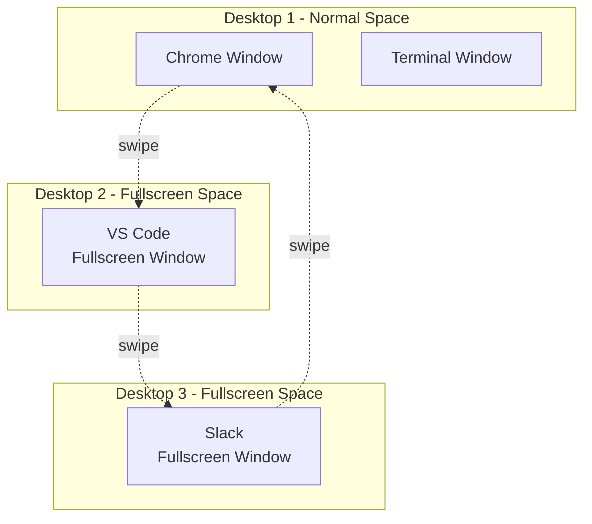
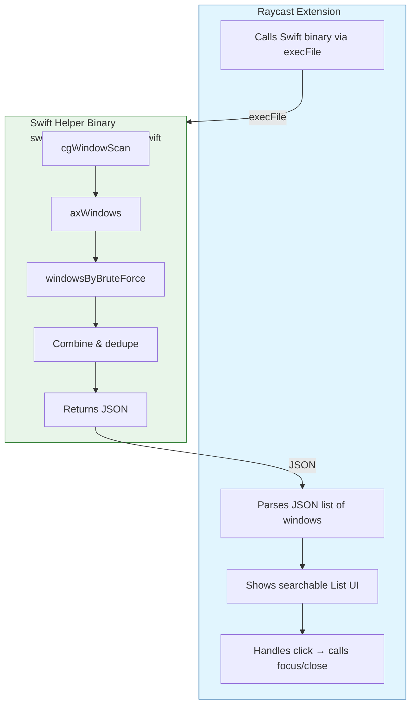
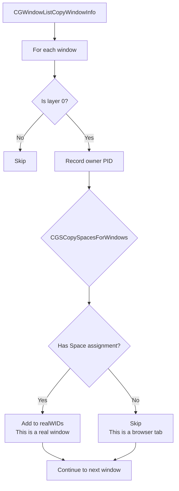
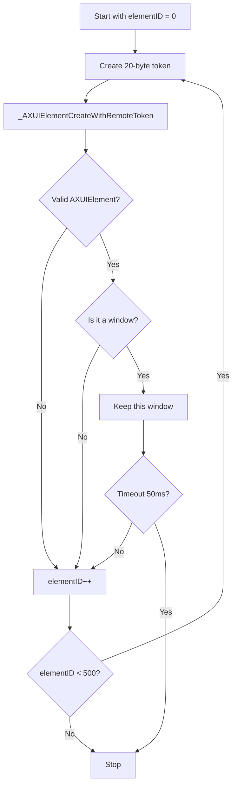
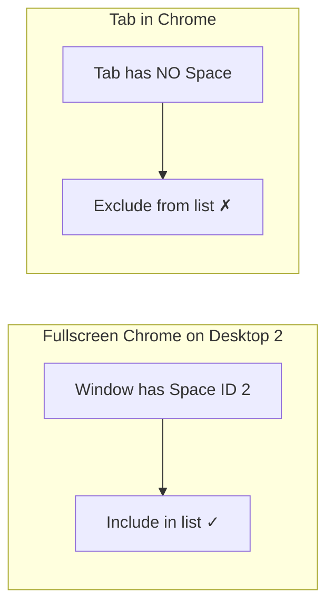
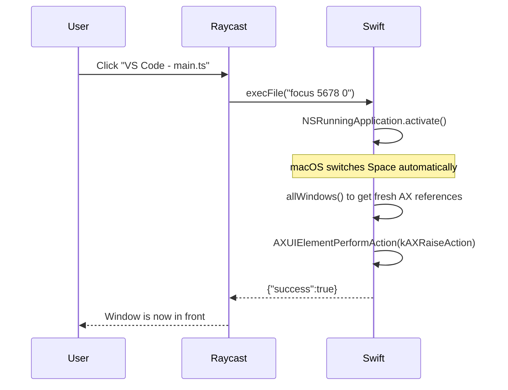
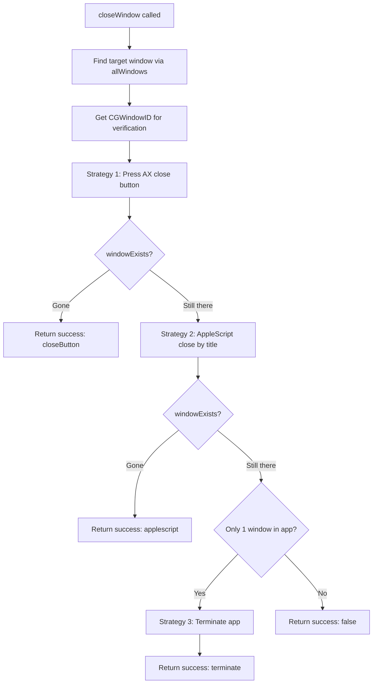
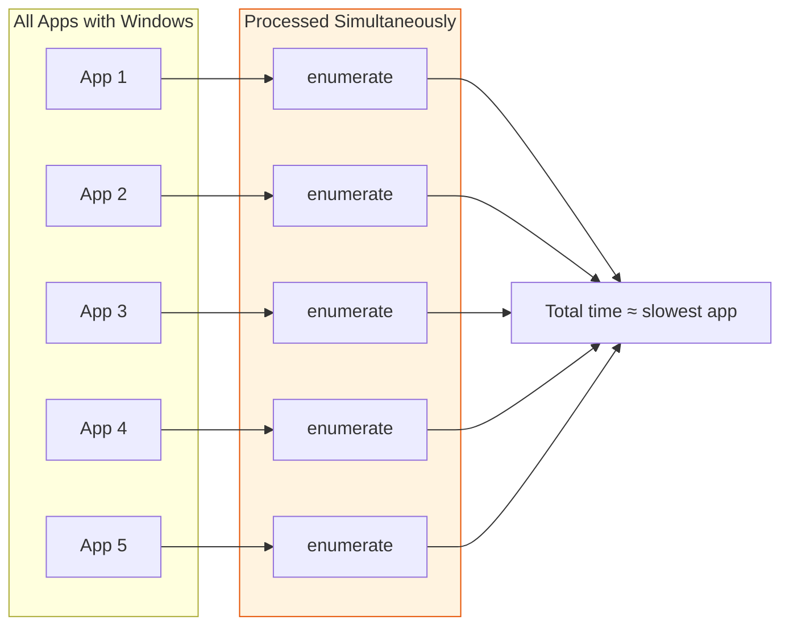

# How Window Ninja Works

This document explains how Window Ninja lists every window across all your apps and macOS Spaces. It covers the problem, why it's harder than it seems, and how the solution works.

---

## The Problem

Raycast's built-in "Switch Windows" shows **one entry per app**, not per window. If you have five VS Code windows open, you only see one.

Window Ninja solves this: it lists **every individual window** across all apps and all macOS Spaces.

---

## What is a macOS Space?

Before diving deeper, you need to understand what a "Space" is on macOS.

When you **fullscreen** an app in macOS, it doesn't just maximize the window — it creates a **separate virtual desktop** called a Space. Each Space is its own isolated desktop:



You switch between Spaces using trackpad gestures (swipe left/right with three fingers).

---

## Why This Is Hard

You might think "macOS should just give me a list of all windows" — but it doesn't work that way.

macOS has **several APIs** to get window information, but each has a limitation:

| API                                             | Gets windows on ALL Spaces? | Gets window titles? | Requires         |
| ----------------------------------------------- | :-------------------------: | :-----------------: | ---------------- |
| AppleScript (System Events)                     |   No (current Space only)   |         Yes         | Accessibility    |
| AXUIElement (standard)                          |   No (current Space only)   |         Yes         | Accessibility    |
| CGWindowListCopyWindowInfo                      |             Yes             |    No (just IDs)    | Screen Recording |
| Private API `_AXUIElementCreateWithRemoteToken` |             Yes             |         Yes         | Accessibility    |

The key issue: **most APIs only see windows on the current Space**. If Chrome is fullscreened on Desktop 2 and you're on Desktop 1, those standard APIs won't see it at all.

---

## The Solution: Combining Multiple APIs

Window Ninja uses **three techniques** together:

1. **Standard Accessibility API** — fast, gets windows on current Space
2. **Private API brute-force** — finds windows on other Spaces
3. **CGWindowList + Space filtering** — distinguishes real windows from browser tabs

Let's understand each step.

---

## Architecture Overview



**Commands:**

- `(no args)` → Returns JSON list of all windows
- `focus <pid> <idx>` → Bring that window to front
- `close <pid> <idx>` → Close that window

---

## Understanding AXUIElement

### What is Accessibility API?

macOS has a built-in **Accessibility system** originally designed for screen readers (like VoiceOver) to help visually impaired users interact with computers.

Every UI element on your screen — every window, button, text field, menu item — has a programming representation called an **AXUIElement**. Think of it as a data structure that describes:

- **What** is this? (window, button, text field)
- **Properties**: title, size, position, is minimized, etc.
- **Actions**: what can you do with it? (click, close, raise)

### How AXUIElement Helps Here

Apps don't expose their windows through a public API. But the **Accessibility API** exposes every window as an AXUIElement, so we can query them programmatically.

The standard Accessibility API can:

- **Query** any UI element: get its title, size, position, etc.
- **Perform actions**: click, close, raise to front

This is what Window Ninja uses to get window titles and to bring/close windows.

---

## Window Discovery: Step by Step

### Step 1: CGWindowList Scan

```swift
func cgWindowScan() -> (realWIDs: Set<CGWindowID>, pidsWithWindows: Set<pid_t>, realWindowCountByPid: [pid_t: Int])
```

Before finding windows, we first do a quick scan using `CGWindowListCopyWindowInfo`. This gives us three things:

1. **Which apps have windows** (`pidsWithWindows`) — so we can skip apps with no windows entirely (performance)
2. **Which windows are "real" vs tabs** (`realWIDs`) — more on this in Step 3
3. **How many real windows each app has** (`realWindowCountByPid`) — so we can skip brute-force when the standard API already found everything



### Step 2: Standard AX API — Current Space

```swift
func axWindows(for pid: pid_t) -> [AXUIElement]
```

For each app that has windows, we first call the **standard Accessibility API**:

```swift
let appElement = AXUIElementCreateApplication(pid)
AXUIElementCopyAttributeValue(appElement, kAXWindowsAttribute, &windowsValue)
```

This returns the correct list of windows with titles — **but only for windows on the current Space**.

If Chrome is fullscreened on Desktop 2 and you're on Desktop 1, this won't see Chrome's window.

### Step 3: Brute-Force — Other Spaces

```swift
func windowsByBruteForce(for pid: pid_t) -> [AXUIElement]
```

This is where the private API comes in. The problem: macOS hides windows on other Spaces from the standard API. The solution: **guess** the window's identifier.

#### What is `_AXUIElementCreateWithRemoteToken`?

This private macOS function lets you **create an AXUIElement** by providing a raw "token" (a 20-byte data blob) instead of relying on the system to enumerate them.

The token format:

| Bytes | Content               | Example            |
| ----- | --------------------- | ------------------ |
| 0-3   | Process ID (pid)      | `1234`             |
| 4-7   | Reserved (zero)       | `0`                |
| 8-11  | Magic number `"coco"` | `0x636f636f`       |
| 12-19 | Element ID            | `0`, `1`, `2`, ... |

The magic `"coco"` marks it as a Cocoa app (most macOS apps).

#### The Brute-Force Process

We don't know which element IDs are valid. So we **try them all**:

```text
For each app:
    For elementID from 0 to 500:
        Create token with this elementID
        Try to create an AXUIElement from it
        Is it a real window? (check subrole)
        Yes → Keep it
        No  → Continue
```



We cap at 500 attempts, 50ms timeout, and 50 consecutive misses per app — real windows are typically found within the first few dozen IDs, and the consecutive-miss threshold ensures we stop early once we've passed the cluster of valid IDs.

### Step 4: Tab vs Window Deduplication

The brute-force method finds **browser tabs** too — they look like windows to the Accessibility API. We need to filter them out.

The trick: **browser tabs have no Space assignment**.

We use `CGSCopySpacesForWindows` to check if a window belongs to a macOS Space:

- **Real windows** → assigned to a Space → include in list
- **Browser tabs** → no Space assignment → exclude



This correctly handles all cases:

| Scenario                                 | Result                |
| ---------------------------------------- | --------------------- |
| 3 tabs in 1 Chrome window                | Only active tab shown |
| 2 fullscreen VS Code on different Spaces | Both shown            |
| Regular window                           | Shown                 |

### Step 5: Combine Results

```swift
func allWindows(for pid: pid_t, realWIDs: Set<CGWindowID>, expectedCount: Int) -> [(element: AXUIElement, title: String)]
```

Finally, we merge the two sources. Returns `(element, title)` tuples so titles are read only once (each title read is an IPC round-trip):

1. Start with **standard API results** (always correct for current Space)
2. Record their CGWindowIDs as "seen"
3. **If standard already found all windows** (count >= `expectedCount`), skip brute-force entirely
4. Otherwise, add **brute-force results** only if:
   - CGWindowID is not already seen (not a duplicate)
   - CGWindowID is in `realWIDs` (not a tab)

---

## How Focusing a Window Works

```swift
func focusWindow(pid: pid_t, windowIndex: Int)
```

When the user clicks a window in the Raycast list:



1. **Activate the app**: `NSRunningApplication.activate()` brings the app to front (macOS automatically switches to the right Space)
2. **Re-discover windows**: Get fresh AX references
3. **Raise the window**: `AXUIElementPerformAction(kAXRaiseAction)` brings that specific window in front of other windows of the same app

---

## How Closing a Window Works

```swift
func closeWindow(pid: pid_t, windowIndex: Int)
```

Closing a window is surprisingly unreliable on macOS — not every app responds to every close method. Window Ninja uses a **three-strategy cascade** that tries each approach in order, verifying success before moving on:



### Strategy 1: Close Button (AX API)

1. Get the close button via `kAXCloseButtonAttribute`
2. Press it via `AXUIElementPerformAction(kAXPressAction)`
3. Wait 200ms, then verify with `windowExists()`

This works for most standard apps.

### Strategy 2: AppleScript

Falls back to AppleScript when the close button doesn't work (common with terminal emulators):

```applescript
tell application id "com.example.app" to close (first window whose name is "My Window")
```

The window is matched **by title**, not by index — AX enumeration order has no guaranteed relationship to AppleScript's window ordering. The title is escaped for special characters. After execution, `windowExists()` verifies the window actually closed (a nil AppleScript error doesn't guarantee close — a confirmation dialog may appear).

### Strategy 3: Terminate App

If the app has only one window and both strategies above failed, terminate the app entirely via `NSRunningApplication.terminate()`.

### Verification Helper

```swift
func windowExists(_ targetWindowID: CGWindowID, pid: pid_t) -> Bool
```

Does a fresh `cgWindowScan()` + `allWindows()` pass and checks if the target CGWindowID is still present. Used by both Strategy 1 and Strategy 2 to confirm the window is actually gone.

---

## Performance Optimizations

The binary runs fresh on every invocation, so speed matters.

### 1. Skip Windowless Apps

`cgWindowScan()` collects `pidsWithWindows` in the same pass. Apps without windows are skipped entirely — no Accessibility calls at all.

### 2. Parallel Processing

`DispatchQueue.concurrentPerform` processes all apps concurrently:



### 3. Bounded Brute-Force

- Maximum 500 element IDs per app
- 50ms timeout per app
- 50 consecutive misses → early exit (IDs cluster low, so gaps mean we're done)

Real windows are found quickly; we don't waste time scanning further.

### 4. Skip Brute-Force When Unnecessary

`cgWindowScan()` counts real windows per PID. If the standard AX API already found all of an app's windows (they're all on the current Space), brute-force is skipped entirely for that app.

### 5. Single Title Read

`allWindows()` returns `(element, title)` tuples. Titles are read once during discovery and reused when building JSON output — avoiding a redundant IPC round-trip per window.

---

## Why Private APIs Are Needed

The private APIs used are:

| API                                 | Why Needed                                                             |
| ----------------------------------- | ---------------------------------------------------------------------- |
| `_AXUIElementCreateWithRemoteToken` | Find windows on other Spaces (standard API only sees current Space)    |
| `_AXUIElementGetWindow`             | Convert AXUIElement to CGWindowID (needed for deduplication)           |
| `CGSCopySpacesForWindows`           | Check if a window belongs to a Space (distinguishes windows from tabs) |
| `CGSMainConnectionID`               | Required by `CGSCopySpacesForWindows`                                  |

These are **real macOS system functions** — Apple wrote them, they're just not documented. They have been stable across macOS versions but could theoretically break in future updates.

---

## Permissions

- **Accessibility**: Required. The Swift binary inherits Raycast's Accessibility trust.
- **Screen Recording**: Not required. Window titles come from Accessibility API, not CGWindowList.

---

## TypeScript Side

The Raycast extension (`src/window-ninja.tsx`) is intentionally simple:

1. **On mount**: Calls `list-windows` with no args, parses JSON
2. **Filter by preference**: Checks `showMinimizedWindows` preference
3. **Render List**: Shows each window with icon, title, app name
4. **Handle actions**: Calls binary with `focus` or `close` subcommand
5. **Search**: Uses built-in Raycast list filtering with `processName` and `windowTitle` as keywords

All the complex window discovery logic lives in Swift — TypeScript just handles the UI.
