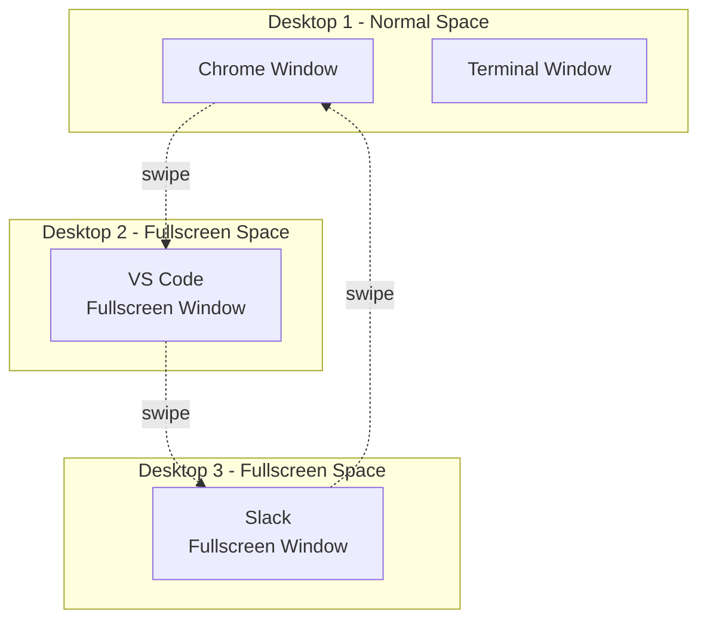
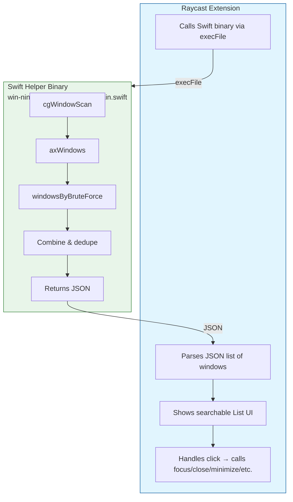
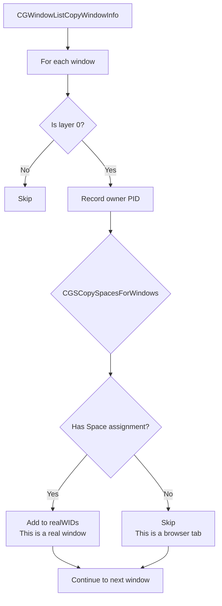
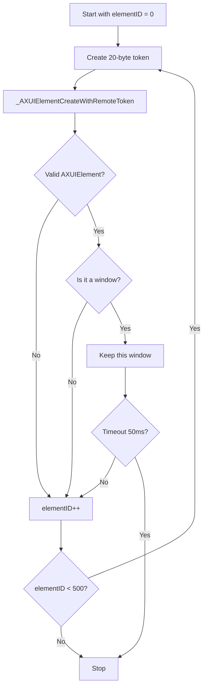
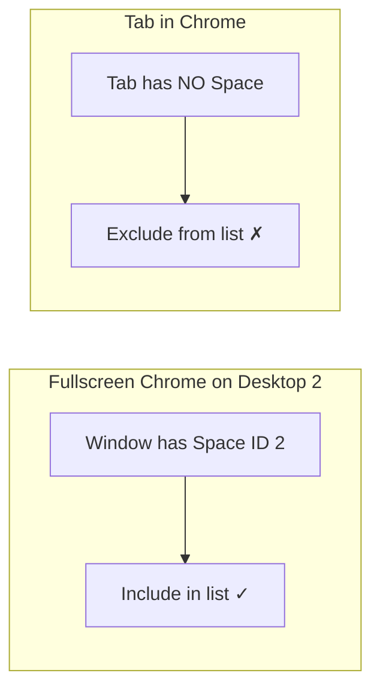
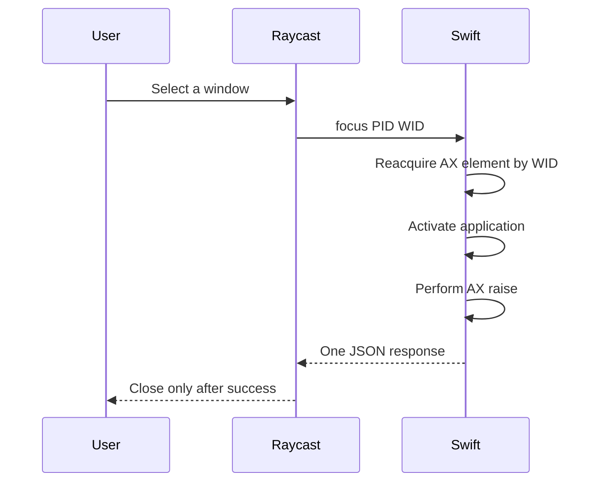
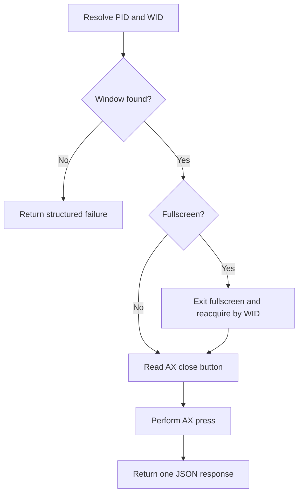
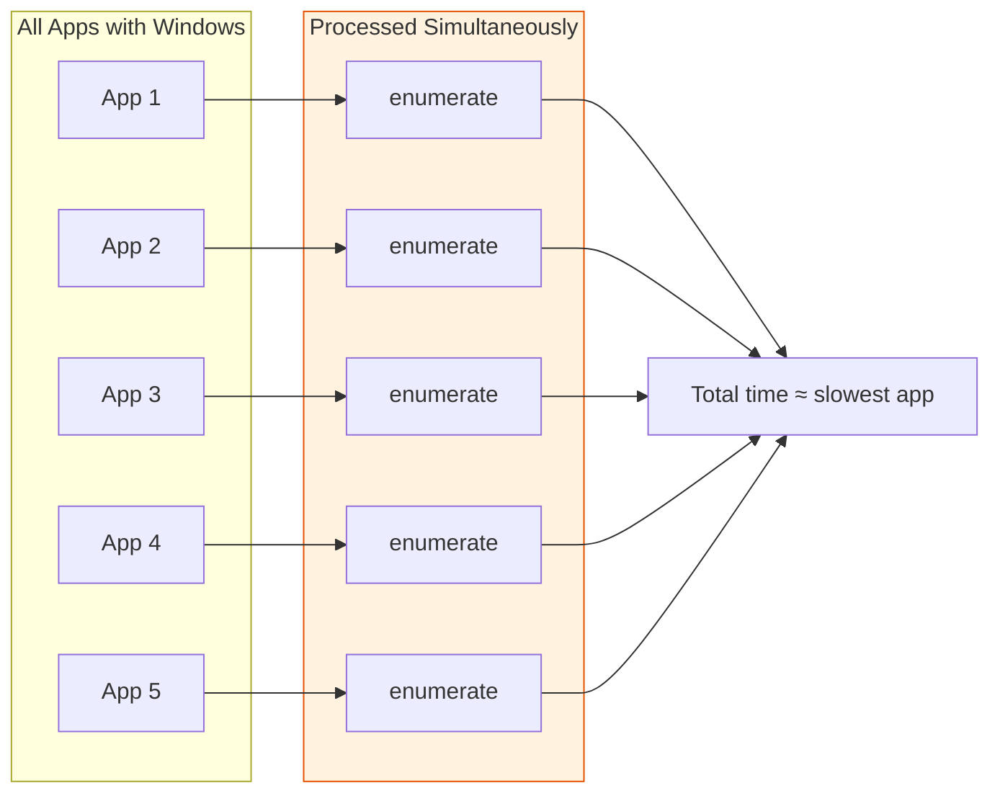

# How Window Ninja Works

This document explains how Window Ninja lists every window across all your apps and macOS Spaces. It covers the problem, why it's harder than it seems, and how the solution works.

---

## The Problem

Raycast's built-in "Switch Windows" shows **one entry per app**, not per window. If you have five VS Code windows open, you only see one.

Window Ninja solves this: it lists **every individual window** across all apps and all macOS Spaces.

---

## What is a macOS Space?

Before diving deeper, you need to understand what a "Space" is on macOS.

When you **fullscreen** an app in macOS, it doesn't just maximize the window — it creates a **separate virtual desktop** called a Space. Each Space is its own isolated desktop:


```mermaid
graph TD
    subgraph "Desktop 1 - Normal Space"
        A1[Chrome Window]
        A2[Terminal Window]
    end

    subgraph "Desktop 2 - Fullscreen Space"
        B1[VS Code<br/>Fullscreen Window]
    end

    subgraph "Desktop 3 - Fullscreen Space"
        C1[Slack<br/>Fullscreen Window]
    end

    A1 -.->|swipe| B1
    B1 -.->|swipe| C1
    C1 -.->|swipe| A1
```

You switch between Spaces using trackpad gestures (swipe left/right with three fingers).

---

## Why This Is Hard

You might think "macOS should just give me a list of all windows" — but it doesn't work that way.

macOS has several APIs for window information, and each has a limitation:

| API                                             | Gets windows on ALL Spaces? | Gets window titles? | Requires                   |
| ----------------------------------------------- | :-------------------------: | :-----------------: | -------------------------- |
| AppleScript (System Events)                     |   No (current Space only)   |         Yes         | Accessibility              |
| AXUIElement (standard)                          |  Not reliably in practice   |         Yes         | Accessibility              |
| CGWindowListCopyWindowInfo                      |             Yes             | No titles used here | No permission for IDs/PIDs |
| Private API `_AXUIElementCreateWithRemoteToken` | Best-effort AX acquisition  |         Yes         | Accessibility              |

Apple does not document `kAXWindows` as current-Space-only. AltTab and AeroSpace both observe that it can omit windows on inactive Spaces, so Window Ninja treats the standard result as incomplete.

---

## The Solution: Combining Multiple APIs

Window Ninja uses **three techniques** together:

1. **Standard Accessibility API** — fast, gets windows on current Space
2. **Private API brute-force** — finds windows on other Spaces
3. **CGWindowList + Space filtering** — distinguishes real windows from browser tabs

Let's understand each step.

---

## Architecture Overview


```mermaid
flowchart TB
    subgraph Raycast["Raycast Extension<br/>src/window-ninja.tsx"]
        R1[Calls Swift binary via execFile]
        R2[Parses JSON list of windows]
        R3[Shows searchable List UI]
        R4[Handles click → calls focus/close/minimize/etc.]
    end

    subgraph Swift["Swift Helper Binary<br/>win-ninja/Sources/WinNinja/main.swift"]
        S1[cgWindowScan]
        S2[axWindows]
        S3[windowsByBruteForce]
        S4[Combine & dedupe]
        S5[Returns JSON]
    end

    R1 -->|execFile| Swift
    S1 --> S2
    S2 --> S3
    S3 --> S4
    S4 --> S5
    S5 -->|JSON| R2
    R2 --> R3
    R3 --> R4

    style Raycast fill:#e1f5fe,stroke:#01579b
    style Swift fill:#e8f5e9,stroke:#2e7d32
```

**Commands:**

- `list` → Returns JSON for all discovered windows
- `(no args)` → Prints help
- `focus <pid> <window-id>` → Bring that window to front
- `close <pid> <window-id>` → Close that window
- `minimize <pid> <window-id>` → Minimize that window
- `maximize <pid> <window-id>` → Unminimize that window
- `fullscreen <pid> <window-id>` → Make that window full screen
- `unfullscreen <pid> <window-id>` → Exit full screen for that window
- `hide-app <pid>` → Hide that application
- `show-app <pid>` → Unhide that application

---

## Understanding AXUIElement

### What is Accessibility API?

macOS has a built-in **Accessibility system** originally designed for screen readers (like VoiceOver) to help visually impaired users interact with computers.

Every UI element on your screen — every window, button, text field, menu item — has a programming representation called an **AXUIElement**. Think of it as a data structure that describes:

- **What** is this? (window, button, text field)
- **Properties**: title, size, position, is minimized, etc.
- **Actions**: what can you do with it? (click, close, raise)

### How AXUIElement Helps Here

Apps don't expose their windows through a public API. But the **Accessibility API** exposes every window as an AXUIElement, so we can query them programmatically.

The standard Accessibility API can:

- **Query** any UI element: get its title, size, position, etc.
- **Perform actions**: click, close, raise to front

This is what Window Ninja uses to get window titles and to bring/close windows.

---

## Window Discovery: Step by Step

### Step 1: CGWindowList Scan

```swift
func cgWindowScan() -> (realWIDs: Set<CGWindowID>, pidsWithWindows: Set<pid_t>, realWindowCountByPid: [pid_t: Int])
```

Before finding windows, we first do a quick scan using `CGWindowListCopyWindowInfo`. This gives us three things:

1. **Which apps have windows** (`pidsWithWindows`) — so we can skip apps with no windows entirely (performance)
2. **Which windows are "real" vs tabs** (`realWIDs`) — more on this in Step 3
3. **How many real windows each app has** (`realWindowCountByPid`) — so we can skip brute-force when the standard API already found everything


```mermaid
graph TD
    A[CGWindowListCopyWindowInfo] --> B[For each window]
    B --> C{Is layer 0?}
    C -->|No| D[Skip]
    C -->|Yes| E[Record owner PID]
    E --> F{CGSCopySpacesForWindows}
    F --> G{Has Space assignment?}
    G -->|Yes| H[Add to realWIDs<br/>This is a real window]
    G -->|No| I[Skip<br/>This is a browser tab]
    H --> J[Continue to next window]
    I --> J
```

### Step 2: Standard AX API — Current Space

```swift
func axWindows(for pid: pid_t) -> [AXUIElement]
```

For each app that has windows, we first call the **standard Accessibility API**:

```swift
let appElement = AXUIElementCreateApplication(pid)
AXUIElementCopyAttributeValue(appElement, kAXWindowsAttribute, &windowsValue)
```

This returns the correct list of windows with titles — **but only for windows on the current Space**.

If Chrome is fullscreened on Desktop 2 and you're on Desktop 1, this won't see Chrome's window.

### Step 3: Brute-Force — Other Spaces

```swift
func windowsByBruteForce(for pid: pid_t) -> [AXUIElement]
```

This is where the private API comes in. The problem: macOS hides windows on other Spaces from the standard API. The solution: **guess** the window's identifier.

#### What is `_AXUIElementCreateWithRemoteToken`?

This private macOS function lets you **create an AXUIElement** by providing a raw "token" (a 20-byte data blob) instead of relying on the system to enumerate them.

The token format:

| Bytes | Content               | Example            |
| ----- | --------------------- | ------------------ |
| 0-3   | Process ID (pid)      | `1234`             |
| 4-7   | Reserved (zero)       | `0`                |
| 8-11  | Magic number `"coco"` | `0x636f636f`       |
| 12-19 | Element ID            | `0`, `1`, `2`, ... |

The magic `"coco"` marks it as a Cocoa app (most macOS apps).

#### The Brute-Force Process

We don't know which element IDs are valid. So we **try them all**:

```text
For each app:
    For elementID from 0 to 500:
        Create token with this elementID
        Try to create an AXUIElement from it
        Is it a real window? (check subrole)
        Yes → Keep it
        No  → Continue
```


```mermaid
graph TD
    A[Start with elementID = 0] --> B[Create 20-byte token]
    B --> C[_AXUIElementCreateWithRemoteToken]
    C --> D{Valid AXUIElement?}
    D -->|No| E[elementID++]
    D -->|Yes| F{Is it a window?}
    F -->|No| E
    F -->|Yes| G[Keep this window]
    G --> H{Timeout 50ms?}
    H -->|No| E
    H -->|Yes| I[Stop]
    E --> J{elementID < 500?}
    J -->|Yes| B
    J -->|No| I
```

We cap at 500 attempts, 50ms timeout, and 50 consecutive misses per app — real windows are typically found within the first few dozen IDs, and the consecutive-miss threshold ensures we stop early once we've passed the cluster of valid IDs.

### Step 4: Tab vs Window Deduplication

The brute-force method finds **browser tabs** too — they look like windows to the Accessibility API. We need to filter them out.

The trick: **browser tabs have no Space assignment**.

We use `CGSCopySpacesForWindows` to check if a window belongs to a macOS Space:

- **Real windows** → assigned to a Space → include in list
- **Browser tabs** → no Space assignment → exclude


```mermaid
graph LR
    subgraph "Fullscreen Chrome on Desktop 2"
        A[Window has Space ID 2] --> B[Include in list ✓]
    end

    subgraph "Tab in Chrome"
        C[Tab has NO Space] --> D[Exclude from list ✗]
    end
```

This correctly handles all cases:

| Scenario                                 | Result                |
| ---------------------------------------- | --------------------- |
| 3 tabs in 1 Chrome window                | Only active tab shown |
| 2 fullscreen VS Code on different Spaces | Both shown            |
| Regular window                           | Shown                 |

### Step 5: Combine Results

```swift
func allWindows(
    for pid: pid_t,
    realWIDs: Set<CGWindowID>,
    expectedCount: Int
) -> [ResolvedWindow]
```

`ResolvedWindow` retains the AX element, title, and `CGWindowID`. The WID provides stable identity across helper invocations.

1. Read standard AX windows and map each element to a WID.
2. Deduplicate the standard result by WID.
3. Skip brute force when the resolved WID count reaches the WindowServer count.
4. Otherwise add brute-force results whose WIDs belong to a Space and are not already present.

---

## How Focusing a Window Works

```swift
func focusWindow(pid: pid_t, windowId: CGWindowID) -> ActionResponse
```

When the user selects a window:


```mermaid
sequenceDiagram
    participant User
    participant Raycast
    participant Swift

    User->>Raycast: Select a window
    Raycast->>Swift: focus PID WID
    Swift->>Swift: Reacquire AX element by WID
    Swift->>Swift: Activate application
    Swift->>Swift: Perform AX raise
    Swift-->>Raycast: One JSON response
    Raycast-->>User: Close only after success
```

The helper resolves the selected `CGWindowID` before activating the application. If the window disappeared, Raycast stays open and shows the returned error.

---

## How Closing a Window Works

```swift
func closeWindow(pid: pid_t, windowId: CGWindowID) -> ActionResponse
```

Closing uses the selected WID throughout:


```mermaid
flowchart TD
    Start[Resolve PID and WID] --> Found{Window found?}
    Found -->|No| Fail[Return structured failure]
    Found -->|Yes| Full{Fullscreen?}
    Full -->|Yes| Exit[Exit fullscreen and reacquire by WID]
    Full -->|No| Button[Read AX close button]
    Exit --> Button
    Button --> Press[Perform AX press]
    Press --> Result[Return one JSON response]
```

The helper does not use AppleScript or terminate the application. **Close Window** only presses the selected window's AX close button. A save confirmation can keep the window open after the AX press; the helper reports that the close request was accepted, not that the application completed every resulting dialog.

---

## Performance Optimizations

The binary runs fresh on every invocation, so speed matters.

### 1. Skip Windowless Apps

`cgWindowScan()` collects `pidsWithWindows` in the same pass. Apps without windows are skipped entirely — no Accessibility calls at all.

### 2. Parallel Processing

`DispatchQueue.concurrentPerform` processes all apps concurrently:


```mermaid
graph LR
    subgraph Apps["All Apps with Windows"]
        App1[App 1]
        App2[App 2]
        App3[App 3]
        App4[App 4]
        App5[App 5]
    end

    subgraph Parallel["Processed Simultaneously"]
        P1[enumerate]
        P2[enumerate]
        P3[enumerate]
        P4[enumerate]
        P5[enumerate]
    end

    App1 --> P1
    App2 --> P2
    App3 --> P3
    App4 --> P4
    App5 --> P5

    P1 & P2 & P3 & P4 & P5 --> Result[Total time ≈ slowest app]

    style Parallel fill:#fff3e0,stroke:#e65100
```

### 3. Bounded Brute-Force

- Maximum 500 element IDs per app
- 50ms timeout per app
- 50 consecutive misses → early exit (IDs cluster low, so gaps mean we're done)

Real windows are found quickly; we don't waste time scanning further.

### 4. Skip Brute-Force When Unnecessary

`cgWindowScan()` counts real windows per PID. If the standard AX result resolves at least that many unique WIDs, the helper skips brute force.

### 5. Single Title Read

`ResolvedWindow` stores each title with its AX element and WID, avoiding a second AX title read while encoding the JSON result.

---

## Why Private APIs Are Needed

The private APIs used are:

| API                                 | Why Needed                                                             |
| ----------------------------------- | ---------------------------------------------------------------------- |
| `_AXUIElementCreateWithRemoteToken` | Find windows on other Spaces (standard API only sees current Space)    |
| `_AXUIElementGetWindow`             | Convert AXUIElement to CGWindowID (needed for deduplication)           |
| `CGSCopySpacesForWindows`           | Check if a window belongs to a Space (distinguishes windows from tabs) |
| `CGSMainConnectionID`               | Required by `CGSCopySpacesForWindows`                                  |

These symbols are undocumented and have no compatibility guarantee. They work on the tested macOS versions, but an OS update can change or remove them without notice.

---

## Permissions

- **Accessibility**: Required for AX window discovery and control. macOS evaluates trust in the helper's execution context.
- **Screen Recording**: Not required. Window titles come from Accessibility, while the CoreGraphics scan uses WIDs, layers, and owner PIDs.

---

## TypeScript Side

The Raycast extension (`src/window-ninja.tsx`) owns the UI and helper protocol:

1. **Load**: Calls `win-ninja list` with a five-second process timeout.
2. **Filter**: Applies the minimized-window preference and Raycast's native fuzzy search.
3. **Render**: Keys items by PID and WID.
4. **Act**: Sends PID and WID for window actions, parses one JSON response, and keeps the List open on failure.
5. **Report**: Uses Toasts for management actions that keep the List visible.
6. **Refresh**: Polls at 120, 350, and 700 ms after transition actions and compares normalized window state rather than raw JSON encoding.

All the complex window discovery logic lives in Swift — TypeScript just handles the UI.
